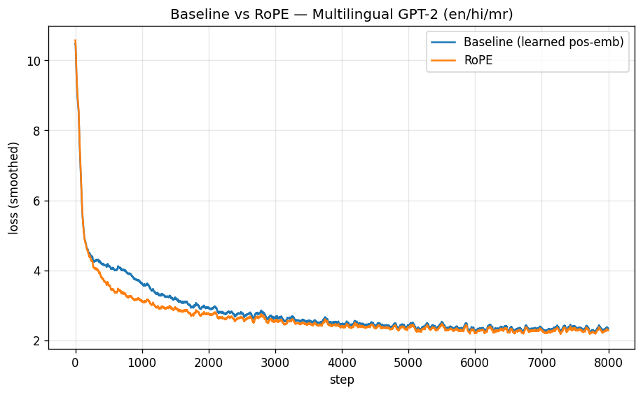

# Multilingual GPT-2 from Scratch — with a RoPE vs. Baseline Attention Experiment

A decoder-only, GPT-2-small–class language model (**~117M parameters**) built and trained **entirely from scratch** in PyTorch, following the nanoGPT approach of Andrej Karpathy — then extended with multilingual training (**English, Hindi, Marathi**) and a controlled **Rotary Position Embedding (RoPE) vs. learned-positional-embedding** ablation.

> ** Live demo:** https://multilingual-gpt2-from-scratch-svczfr4nsagzkrdvqbhybg.streamlit.app/
> ** Trained weights:** https://huggingface.co/yuv05/multilingual-gpt2-scratch-weights
> ** Full report:** [gpt_2 report.pdf](gpt_2_report.pdf)

---

## What this project does

- Implements a decoder-only transformer from scratch: **byte-level BPE tokenizer, causal self-attention, pre-norm transformer blocks, weight tying, cosine LR schedule** — no pretrained or library model.
- Trains on **three languages / two scripts** (Latin + Devanagari), streamed and script-filtered from `allenai/c4`.
- Runs a **controlled experiment**: two otherwise-identical models, one with learned positional embeddings ("baseline") and one with **RoPE**, trained for 8,000 steps each on the same data.

## Model configuration

| | |
|---|---|
| Layers / heads / d_model | 12 / 12 / 768 |
| Vocabulary (byte-level BPE) | 32,000 |
| Context length | 512 |
| Parameters | ~117M (baseline), ~116.8M (RoPE) |
| Training tokens | ~262M per model |
| Hardware | single NVIDIA T4 (Kaggle) |

## Headline result

**RoPE converged faster and achieved a small, consistent perplexity improvement across all three languages**, while using *fewer* parameters (it replaces the learned positional table with a parameter-free rotation). Both models reached a similar final training loss.



**Held-out perplexity (lower is better):**

| Language | Baseline | RoPE |
|---|---|---|
| English | 210.3 | **189.5** |
| Hindi | 6.4 | **6.1** |
| Marathi | 6.5 | **6.3** |

*Note: perplexity is comparable **within** a language (baseline vs. RoPE), not across languages — the byte-level tokenizer segments each script with different granularity, so cross-language values are not directly comparable.*

## Honest scope

This is a **base language model**, not a chatbot: it continues text rather than answering questions. Trained on ~262M tokens (~5% of GPT-2's original budget), its output is locally fluent but drifts over long spans — expected at this scale, and consistent with the educational goal of understanding the architecture end-to-end. See the [full report](gpt_2_report.pdf) for the complete analysis.

## Repository contents

| File | What it is |
|---|---|
| [gpt_2 report.pdf](gpt_2_report.pdf) | Full technical report — architecture, method, results, analysis |
| `training.ipynb` | The from-scratch training notebook (Kaggle) |
| `app.py` | Streamlit demo — generate text, compare both models side by side |
| `requirements.txt` | Python dependencies for the demo |
| `comparison.png` | Training-loss curves (baseline vs. RoPE) |
| `perplexity_results.json` | Per-language evaluation results |

## Live demo

The Streamlit app lets you enter a prompt in English, Hindi, or Marathi and generate a continuation from either model — or **compare baseline vs. RoPE side by side**. It also displays the perplexity table and loss curve.

**Weights are hosted on Hugging Face** ([model repo](https://huggingface.co/yuv05/multilingual-gpt2-scratch-weights)) and downloaded automatically by the app at runtime, so the demo needs no local model files.

> **Note:** the demo runs on Streamlit's free tier. It sleeps after inactivity and takes ~1–2 minutes to warm up on the first visit (downloading the models on cold start), then responds in a few seconds per generation.

**Prompting tip:** this is a base model, so use *openers* rather than questions, and prefer longer in-language prompts (e.g. "भारत एक बहुत बड़ा और विविधतापूर्ण देश है, जहाँ"). Temperature ≈ 0.55 and top-k ≈ 15 give the cleanest, most in-language output.

## Run the demo locally

```bash
git clone https://github.com/yuvi5555/multilingual-gpt2-from-scratch.git
cd multilingual-gpt2-from-scratch
pip install -r requirements.txt
streamlit run app.py
```

No manual weight download needed — `app.py` pulls the models and tokenizer from the
[Hugging Face model repo](https://huggingface.co/yuv05/multilingual-gpt2-scratch-weights)
automatically on first run and caches them locally.

## Reproduce training

Open `training.ipynb` on Kaggle with a GPU, run top to bottom. It trains both models back-to-back (~8.5h on a T4) and saves all artifacts. Set `use_rope` to switch schemes, or use the combined cell that trains both.

---

*Built as an internship capstone by **Yuvraj Rajure**. Inspired by Andrej Karpathy's nanoGPT.*
